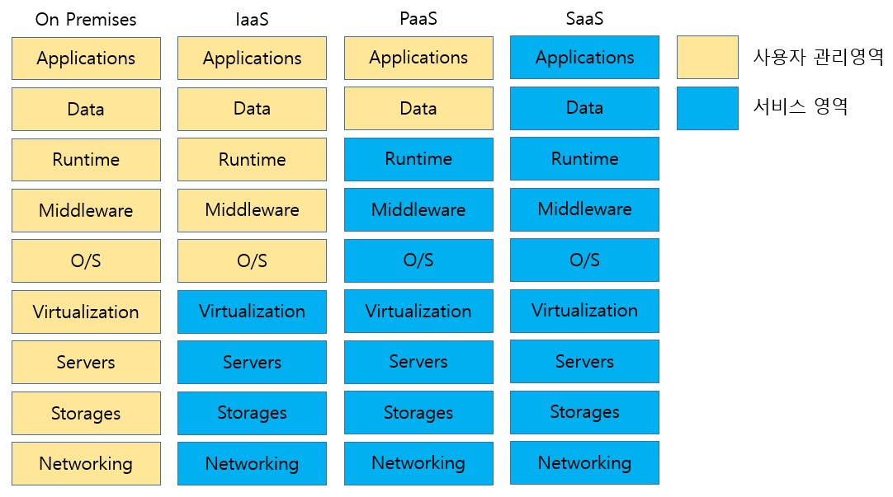

# PaaS 정리

제가 개인적으로 kubernetes에 관한 공부를 한 내용을 정리할 저장소입니다.

+ ##  PaaS란 ( Platform as a Service )
>   PaaS provider는, 사용자가 application 개발에 집중할 수 있도록, platform을 서비스합니다.
>   
>   사용자는 개발 tool 설치, 환경변수 관리, version 관리 등을 provider에게 맡기고 그 platform을 사용하게 됩니다.
>  
+ ## PaaS 등장 배경
>  
> 
>  cloud가 등장하기 이전에는 applicaion을 서비스하기 위해 baremetal부터 middleware를 거쳐 application을 모두 관리해야했습니다.  
>
>  이 경우, 사용자가 관리해야할 리소스가 많고 baremetal들을 구매하는 초기비용이 크게 발생합니다.
>  
>  Cloud가 등장하면서, 마치 수돗물처럼 외부 컴퓨팅 리소스를 필요한 만큼만 사용할 수 있는 서비스가 등장했습니다. (IaaS Infra as a Service)
>  
>  이 때, 사용자는 infra에 대한 걱정없이 application을 개발하고 배포할 platform 이후의 영역을 관리하게 됩니다. (AWS, GCP, Azure )
>  
>  하지만 개발자의 입장에서, 개발 tool을 설치하고 version을 관리하는 것은 큰 overhead입니다.   
>  
>  위와 같은 문제로, 사용자가 필요로하는 platform을 구축해서 제공하는 service가 등장합니다. (PaaS Platform as a Service)
>  
>  PaaS 사용자는, 본인들이 원하는 platform에서, application의 개발에만 집중할 수 있기 때문에 인적 자원을 고려한다면 매력적인 서비스입니다. ( Heroku, OpenShift, AWS beanstalk )
>  
>  한편, 개발을 전문으로 하는 회사가 아니라면, application을 직접 개발하기 보단, 비용을 내고 이용하는 것이 더 효율적일 수 있습니다. 
>  
>  이런 니즈를 충족 시키기 위해 SaaS가 등장했습니다. (Software as a Service)
>  
>  서비스 제공자가, 버그 관리, 버전 업데이트 등을 모두 담당하며, 사용자는 완성된 application을 사용할 수 있습니다. ( G-mail, N drive )

+ ## PaaS 사용 형태

> PaaS를 어떤 형태로 구축해서 사용하는지 알아보겠습니다. 
> 
>> ### Heroku
>>  
>>     salesforce소속으로, container기반으로 운영되는 PaaS입니다.
>>    
>>     다양한 programming language를 지원합니다. ( Node, Python, php, Ruby, java, Go )
>>    
>>     사용자가 작성한 application은, Dynos라는 내부 서비스를 통해 containerization되어 실행됩니다.
>>    
>>     Apphook 기능을 지원하며, 이를 통해 application 실행 중, 발생한 event에 대한 알림을 받을 수 있습니다.
>>    
>>     Heroku OpEx라는 이름으로 application level의 autoscaling기능을 서비스합니다.
>>      
>>     Heroku DX에서, app의 metric을 볼 수 있는 monitoring 기능과 app을 실행시킬 수 있는 Heroku Button 기능과, Postgres Dbx로 손쉬운 database usage를 제공합니다.
>>    
>>      Heroku pipeline : 하나의 application을 4가지 stage에서 공유할 수 있습니다. ( development, review, staging, production )
>>    
>>      Heroku CI : Heroku pipeline에 연동된 github에, push할 때마다 사용자가 설정한 test를 진행합니다.
>>    
>>      Review apps : app에 대한 temporary test를 진행할 수 있는 서비스
>>    
>>      Github Integration : Heroku app과 github repo를 연동시킵니다.
>>    
>>      Heroku ChatOps : heroku pipeline을 slack과 연동시켜주는 서비스
>>    
>>      Release Phase : production환경으로 deploy하기 전에, 여러 task를 진행해볼 수 있는 서비스
>>  
>>      Heroku에서는 위처럼 사용자가 repo를 Heroku app과 연동한 뒤 코드를 작성하면,dynos를 통해 containerization을 해주고, 원한다면 CI/CD 서비스를 제공하고 OpEx를 통해 운영서비스까지 제공합니다.

>>  ### OpenShift
>>     RedHat에서 제공하는 container application platform입니다.
>>    
>>     크게 managed와 self-managed  두 가지 형태로 서비스를 제공합니다.
>>    
>>     managed에서는, vendor별로 나누어 서비스를 제공합니다.
>>    
>>     Ret Hat + Azure
>>    
>>     Ret Hat + IBM
>>    
>>     Ret Hat + AWS
>>    
>>     Ret Hat only
>>    
>>     self-managed에서는 Ret Hat + container platform, Ret Hat + kubernetes engine 두 가지 서비스를 제공합니다.
>>    
>>     전자는 enterprise level의 application을 배포하는데 적절하고, 후자는 openshift를 경험하는 정도로 사용하기에 적당합니다.
>>    
>>     마찬가지로, git과 연동이가능하며 CI/CD를 제공합니다.
>>    
>>     여러 language에 대해, template을 제공하기 때문에 쉽게 접근할 수 있습니다.
>        
>   두 가지 대표적인 PaaS에서 제공하는 기능들을 알아봤습니다.
>    
>   공통적으로 개발자들은, code를 작성한 뒤, push하는 것 까지만 책임지고, 나머지작업(CI/CD,운영)은 provider에서 해결하는 모습입니다.
>
>   heroku에서는, CI/CD에서 test를 custom할 수 있는 기능을 추가했고 openshift에서는 IaaS vendor를 선택할 수 있는 옵션을 만들어 차이점을 두었습니다.
    
      
