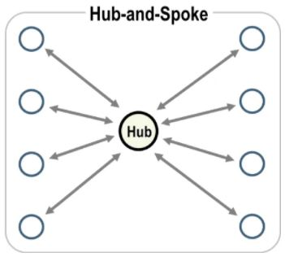

# kubernetes 내부 구조
>  kubernetes가 어떤 방식으로 cluster를 구성하는지 알아보겠습니다.
# 구성요소
+ ## master node
  Node를 scheduling, monitoring합니다.   
  
  master node cluster를 control plane이라고 합니다.
  
  ### master node 구성요소
  + ### etcd  
    etcd는 linux의 /etc directory에서 유래했습니다.
    
    key-value store로, cluster 구성요소에 대한 정보를 master node에 분산 저장합니다.
    
    
    - Node 정보 ( clusterip, status, resource, tag )
    
    - kubernetes resource 정보 ( POD, service, Volume etc)
    
    control plane에서 etcd를 운영하는 방법과, 외부에서 운영하는 두 가지방법이 있습니다. 
    
    분산 저장할 때, RAFT algorithm을 이용합니다.   
    
    http://thesecretlivesofdata.com/raft/ 이곳으로 가시면, RAFT algorithm을 animation으로 확인 할 수 있습니다.
   
  + ### kube-apiserver
  
    kube-apiserver는 kubernetes component와 통신합니다.
    
    모든 component는 서로 직접적으로 통신하지 않고, kube-apiserver를 통해서 통신합니다. ( spike and poke 방식 )
    
    
    
    사용자는 kubectl를 통해 kube-apiserevr와 통신하며, cluster의 상태를 확인하고 설정을 변경할 수 있습니다.
    
    이때 admin.conf를 통해 사용자 인증절차를 진행합니다.
    
    POD에서, application은 POD의 service account와 role을 통해 kube-apiserevr와 통신합니다.
    
    각 구성요소와 통신하면서 etcd를 최신화힙니다.
    
    Scheduler로부터 받은 정보를 통해 kubelet에게 POD를 실행하도록 합니다.
  
  + ### kube controller-manager
   
    다양한 controller들이 모여있는 곳입니다.
    
      + #### Node-controller
      
        Node의 health check를 주기적으로 진행하며, 필요한 경우 Node에서 POD를 추출해 다른 Node로 옮깁니다.
       
      + #### Replication-controller
      
        POD의 replica가 desired 개수만큼 유지되는지 확인합니다.
      
      + #### Deployment-controller
      
        Deployment를 관리합니다.
        
      + #### Namespace-controller
      
        cluster내부의 namespace들을 관리합니다.
    
    더 자세한 내용은 추후에 다루겠습니다.
  + ### kube scheduler
  
    POD를 scheduling합니다.
    
    Node상태를 kube-apiserevr로 부터 받아, POD가 적절한 Node에서 실행되도록 합니다.
    
    또한, POD의 제한사항을 반영해 특정 Node에서 실행되도록 합니다.
    
    
 
+ ## worker node

  Application을 container단위로 hosting합니다.
  
  ### worker node 구성요소
  
    worker node의 구성요소는, master node에도 공통적으로 존재합니다.
  
  + ### docker
  
    실질적으로 application을 실행하는 구성요소입니다.
   
    application을, docker image를 통해 container기반으로 실행합니다.
  
  + ### kubelet
  
    해당 Node의 docker가 container를 실행하도록 합니다.
    
    kube-apiserver와 통신하며, kube-scheduler의 order에 따라 POD를 실행합니다.
    
    해당 Node와 실행중인 POD의 health check를 진행하며  각 node의 대변인 역할을 합니다.
  
  + ### kube-proxy

    cluster내부의 구성요소들 끼리 통신할 수 있도록 하는 것이 바로 kube-proxy입니다.
    
    POD간 통신을 진행할 때, destination POD의 정보를 제공합니다.

